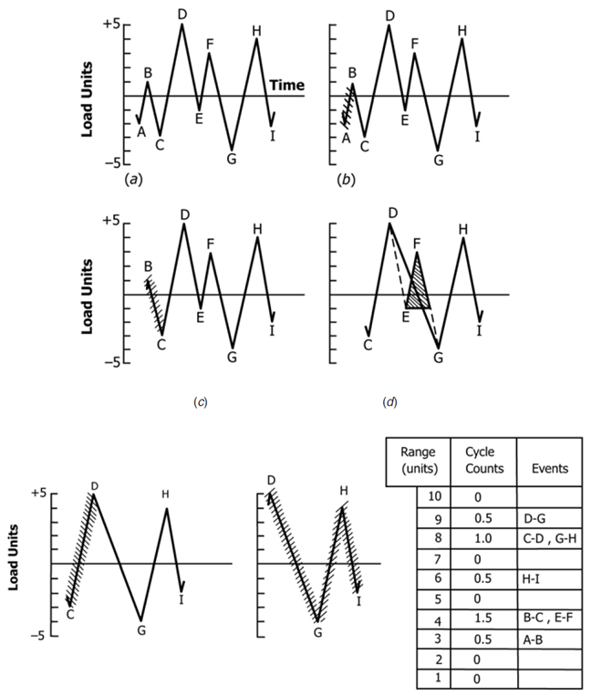
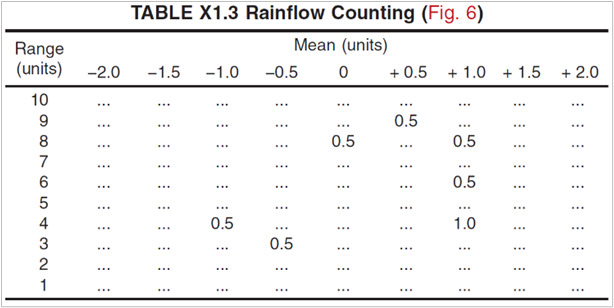
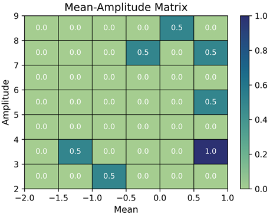
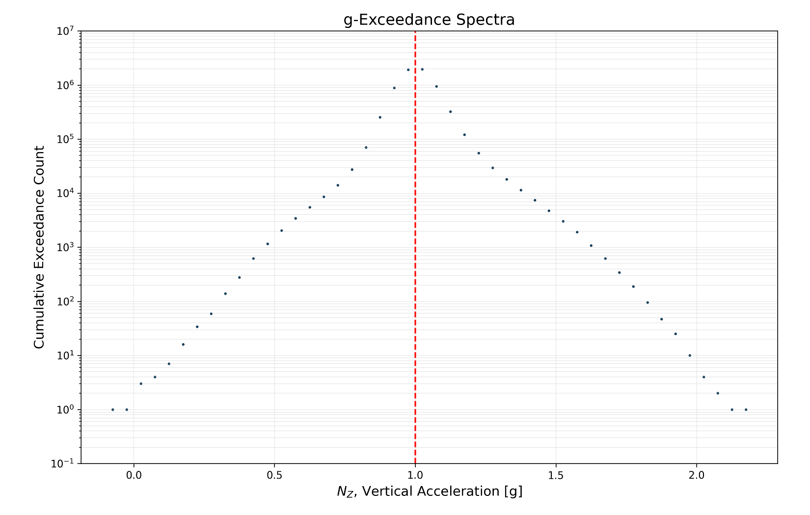
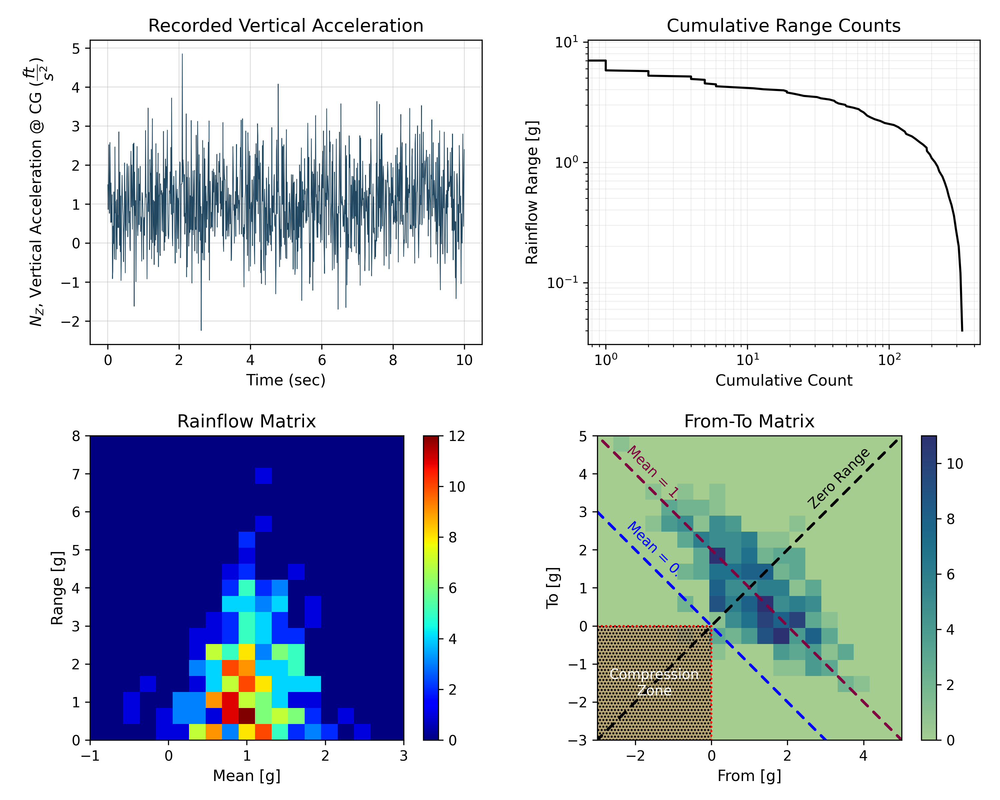

# Fatigue Load Spectrum Measurement

*A program that analyzes data from inertia measurement units installed in
aircraft and generates g-exceedance curves.*

The main file to run the tool is [main.py](main.py).

Load monitoring is a method of determining load spectrum which can be
considered an aircraft experiences during its various missions. This load
spectrum is used for estimating the fatigue life of the aircraft and is of
great importance. A large category of airplanes is fatigue-critical as opposed
to static-critical, therefore, it is crucially important to have reasonable and
meaningful load spectra when designing for fatigue life.

This tool, summarizes the recorded acceleration data into various family of
cycles with a particular range of mean and amplitude values, known as the
**mean-amplitude matrix**. Using this matrix, a simplified NZ
spectrum is
formed over which the level-cross counting is performed to produce a
g-exceedance plot.

Despite having several flavors, rainflow algorithm is an industry standard
for counting the hysteresis cycles. The version of the algorithm that is
used in the current program to count the stress cycles is an
implementation of **ASTM E1049-85** in Python.

The image above shows the example presented in "ASTM E1049-85". The
resulting cycle count is shown below.

Using the current rainflow counting tool, the same analysis results in the
following graph. Comparing the last two images above and below shows that the
current tool reproduces the same results as the ASTM. Although this is not
a comprehensive validation, but can be relied on for now.

Since the data is proprietary, they cannot be presented here but below, a
sample of the g-exceedance plot that is generated by the tool based on 3
flights with the average length of 4 hours is shown.

Additional plots can be produced using this tool as well including
"Cumulative Range Count", "from-to matrix", "range-mean matrix" and the raw
data as shown below.

